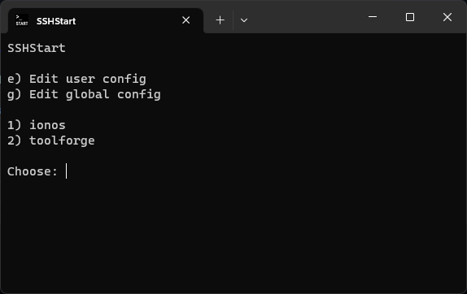

# SSHStart - Secure Shell Start

SSHStart allows you to easily view, edit, and launch your saved SSH hosts. With it, you can list and choose an SSH host to enter or view/edit your system-wide and user-specific SSH host.

## Integrations

The installer offers integration into the Windows Terminal and the system path. System path integration allows SSHStart to be run with the command `sshs` from the command line.

## Building

SSHStart is built with Visual Studio, which offers the easiest way to build SSHStart. The installer is built from `install.iss` with Inno Setup. Tests can also be run in Visual Studio. They are located in the "SSHStartTest" project.

## Screenshot

